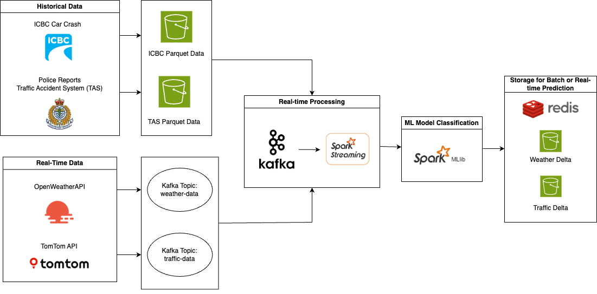

<!-- Top Anchor -->
<a id="readme-top"></a>

<!-- Title -->
<h3 align="center">British Columbia Car Crash Predictor</h3>

<p align="center">
  In this project, we analyze car crash incidents in British Columbia, Canada, and predict real-time hotspots for car crashes.
  <br />
  <a href="https://github.sfu.ca/gma89/van-crash-predictor"><strong>Explore the code »</strong></a>
  <br />
  <br />
  Contributors: 
  <a href="https://github.sfu.ca/gma89">Gloria Mo</a> · 
  <a href="https://github.sfu.ca/rla187">Rojin Lohrasbinejad</a> · 
  <a href="https://github.sfu.ca/sha392">Swaifa Haque</a>
</p>

---

<!-- Table of Contents -->
<details>
  <summary>Table of Contents</summary>
  <ol>
    <li><a href="#about-the-project">About The Project</a>
      <ul>
        <li><a href="#project-pipeline">Project Pipeline</a></li>
      </ul>         
      <ul>
        <li><a href="#built-with">Built With</a></li>
      </ul>
    </li>
    <li><a href="#data-engineering">Data Engineering</a>
      <ul>
        <li><a href="#extracting-the-data">Extracting the Data</a></li>
        <li><a href="#transforming-the-data">Transforming the Data</a></li>
        <li><a href="#loading-the-data">Loading the Data</a></li>
      </ul>
    </li>
    <li><a href="#machine-learning">Machine Learning</a>
      <ul>
        <li><a href="#machine-learning-model">Machine Learning Model</a></li>
        <li><a href="#training-data">Training Data</a></li>
        <li><a href="#model-prediction">Model Prediction</a></li>
      </ul>
    </li>    
    <li><a href="#visualization">Visualization</a>
      <ul>
        <li><a href="#tableau-dashboard">Tableau Dashboard</a></li>
        <li><a href="#others">Others</a></li>
      </ul>
    </li>    
    <li><a href="#usage">Usage</a></li>
    <li><a href="#results">Results</a></li>
  </ol>
</details>

---

## About The Project

This project analyzes historical car crash data in British Columbia to predict high-risk locations for future incidents. The system is built using Python, Apache Spark, Apache Kafka, and PySpark.ML for data processing and machine learning. The results are visualized using Seaborn, Folium, and a dashboard in Tableau for intuitive insight presentation.

<p align="right">(<a href="#readme-top">back to top</a>)</p>

### Project Pipeline: 


### Built With

* 
* 
* 
* 
* 
* 
* 

<p align="right">(<a href="#readme-top">back to top</a>)</p>

## Setup & Run Locally

### 1. Clone the Repository
```
git clone git@github.sfu.ca:gma89/van-crash-predictor.git
cd van-crash-predictor
```

### 2. Start the Application with Docker Compose
Make sure you have Docker and Docker Compose installed.
```
docker-compose up --build
```
This will spin up the entire pipeline, including:
- Kafka and Zookeeper (for streaming)
- Redis (for storing predictions)
- Spark Structured Streaming job (for real-time inference)
- Optional producers for weather/traffic data

The system will begin ingesting data and making real-time crash hotspot predictions.

### 3. Explore or Retrain the ML Model
If you want to explore or retrain the model manually:
```
jupyter notebook model/ml_model.ipynb
```

This notebook includes feature engineering, training, and evaluation steps.

<p align="right">(<a href="#readme-top">back to top</a>)</p>

---

## Data Engineering

In the Data Engineering process, we focus on extracting, transforming, and loading (ETL) data from various sources to prepare it for machine learning and analysis. The data engineering pipeline is broken down into multiple stages and includes files for geocoding, cleaning, merging, and producing data for the machine learning models.

### Extracting the Data

The key datasets used in this project are as follows:
- **TAS Data** (Traffic Accident System Data): Contains details about where and how accidents happened in British Columbia (BC).
- **ICBC Data** (Insurance Corporation of British Columbia): Contains historical accident data that includes attributes such as location, weather, time, and crash severity.
- **TomTom Traffic Flow API**: Contains live traffic flow data of British Columbia roads and streets.
- **Open Weather API**: Contains live weather reports of British Columbia, including temperature, visibility, and description.

### Transforming the Data

We perform several transformation steps to clean, standardize, and enrich the crash datasets before merging them with real-time traffic and weather information:
- **Standardizing Column Names**: Ensures consistency across all datasets (TAS, ICBC, weather, traffic).
- **Geocoding:** Converts city and location names into precise latitude and longitude coordinates using Azure Maps.
- **Feature Extraction:** Extracts relevant features like crash severity, time of day, weather descriptions, and road conditions.
- **Binning:** Latitude and longitude are binned to spatial grids for location-based aggregation.
- **Imputation:** Missing values in numeric and categorical fields are imputed using appropriate statistical methods.
- **Aggregation:** Data is grouped by location and hour to generate features used in model training (e.g., average speed, temperature, traffic density).
Streaming Preprocessing: Kafka streaming data is parsed, windowed, and aggregated in real-time using Spark, then stored in Redis.

### Loading the Data

Once transformed, the datasets are loaded into highly compressed Parquet files (LZ4 and Snappy) and stored in an S3 bucket for distributed access and model training. The cleaned and merged dataset is used downstream by:
- Machine learning model training and evaluation scripts.
- Real-time prediction pipelines for crash hotspot detection.
- Visual dashboards and heatmaps.
Redis is used to serve the latest aggregated traffic and weather data during real-time inference, while Spark handles all batch and streaming ETL.

<p align="right">(<a href="#readme-top">back to top</a>)</p>

---

## Machine Learning

This project uses supervised learning to predict crash severity risk at specific locations and times. The model is trained using historical crash data enriched with weather and traffic context.

### Machine Learning Model

The core model is a Random Forest Classifier, chosen for its robustness and interpretability. The pipeline includes:
- Feature selection and engineering
- Cross-validation for hyperparameter tuning
- Labeling crash hotspots into low, moderate, and high risk
- Exporting model stages and metadata for reproducibility
All model artifacts are saved in the /Model directory.

### Training Data
The training dataset is composed of cleaned, enriched crash records with the following features:
- **Temporal data:** hour, weekday, time period
- **Location data:** lat/lon bins, nearest intersection
- **Weather data:** temperature, visibility, description
- **Traffic flow:** congestion levels, average speed
- **Crash metadata:** number of injuries, vehicles involved, road conditions
Data is split into training and validation sets, and cross-validation ensures generalization.

### Model Prediction
After training, the model generates crash risk scores for location-time combinations, which are used to label zones as:
- **Low risk:** Low probability of crash occurrence
- **Moderate risk:** Some crash indicators present
- **High risk:** Strong indicators of upcoming crash risk

<p align="right">(<a href="#readme-top">back to top</a>)</p>

---

## Visualization

### Tableau Dashboard
The dashboard features an interactive map displaying all accident locations from 2019 to 2023. In addition, various charts provide insights into the causes of accidents and other contributing factors, helping to analyze patterns and trends in road safety.


### Others

We have a interactive hotspot heatmap as an HTML file. 

<p align="right">(<a href="#readme-top">back to top</a>)</p>

---

## Usage
The crash prediction model aims to enhance road safety in British Columbia by predicting potential crash hotspots. This can help alert drivers and authorities to high-risk areas, contributing to safer roads for both people and road users.
<p align="right">(<a href="#readme-top">back to top</a>)</p>

---

## Results
The model successfully identifies historical high-risk locations with good accuracy. Evaluation metrics show:
- **Accuracy:** 86% on validation data
- **Precision/Recall:** Balanced performance across risk categories
- **Feature Importance:** Weather, speed, time of day, and traffic flow are strong predictors
In addition, the real-time streaming pipeline processes traffic and weather updates in near real-time (~1s latency), and the Redis cache enables fast risk score retrieval for visualization and alerting.
<p align="right">(<a href="#readme-top">back to top</a>)</p>

---

### What to look for: 
- **Crash Hotspot Prediction Accuracy**: Check how well the model predicts known high-risk intersections in the city using historical data.
- **Model Metrics**: Review precision and recall scores in `notebooks/ml_model.ipynb`.
- **Streaming Pipeline**: Validate real-time data ingestion through Apache Kafka by monitoring console logs or using Kafka UI tools (e.g., Confluent Control Center if set up).
- **Visualizations**: Explore the interactive Tableau dashboard, which displays an accident heatmap and crash trends using time and weather filters.
